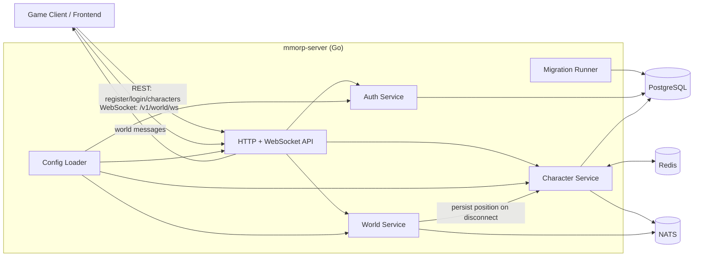

# Architecture Overview

## High-Level Design

`mmorp-server` is a modular monolith with clear boundaries between delivery, application, domain, and platform layers.

- Delivery layer: HTTP + WebSocket handlers (`internal/api`)
- Application layer: use-case services (`internal/app/auth`, `internal/app/character`, `internal/app/world`)
- Domain layer: core models (`internal/domain/*`)
- Platform layer: adapters for Postgres, Redis, NATS, migrations, config, logging (`internal/platform/*`)

The server is authoritative for world movement state and broadcasts periodic snapshots.

## Runtime Components

- API Server (Go process)
- PostgreSQL (system of record)
- Redis (cache-aside for character list)
- NATS (domain event publishing)
- WebSocket clients (game clients)

## Component Diagram

## Process Lifecycle

1. Load env config.
2. Initialize logger.
3. Connect Postgres.
4. Run SQL migrations.
5. Connect Redis (optional fallback to no cache).
6. Connect NATS publisher (optional fallback to noop publisher).
7. Start world tick loop.
8. Start HTTP server.
9. On SIGTERM/SIGINT, gracefully shut down HTTP server and world loop.
