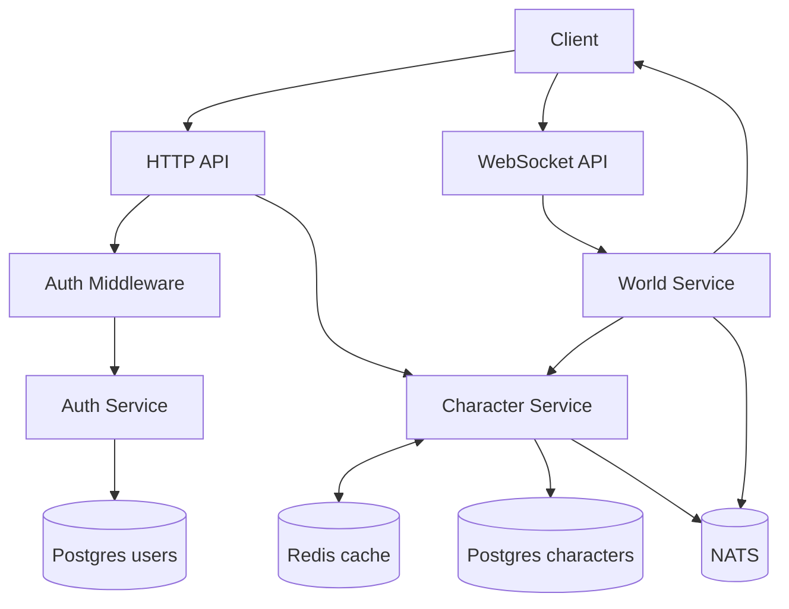

# Data Flow

## 1. Authentication Flow

1. Client sends register/login request.
2. API handler decodes and validates payload shape.
3. Auth service validates credentials.
4. For register, service hashes password and inserts into `users`.
5. Service issues JWT token (`sub=<user_id>`, `exp` based on `JWT_TTL`).
6. API returns `{user_id, token}`.

## 2. Character Creation Flow

1. Client calls `POST /v1/characters` with bearer token.
2. Auth middleware parses JWT and injects `user_id` into request context.
3. Character service validates `name`, defaults `class` if empty.
4. Character row is inserted in Postgres with default position `(0,0)` and configured `WORLD_ZONE_ID`.
5. Redis list cache key for user is invalidated.
6. Event `character.created` is published to NATS.
7. Created character JSON is returned.

## 3. Character List Read Flow

1. Client calls `GET /v1/characters`.
2. Character service checks Redis key `characters:user:<user_id>`.
3. Cache hit: deserialize and return.
4. Cache miss: query Postgres, then cache serialized list with `CHARACTER_CACHE_TTL`.

## 4. World Join / Move / Simulation Flow

1. Client opens WebSocket `GET /v1/world/ws` with JWT.
2. API validates token and upgrades connection.
3. World service registers client.
4. Client sends `join` message with owned `character_id`.
5. API verifies ownership via character service.
6. World service adds player state and sends `welcome`.
7. Client sends `move` messages (`dx`, `dy`).
8. World service updates in-memory player position and publishes `player.moved`.
9. Tick loop emits `snapshot` to all clients at `WORLD_TICK_RATE`.
10. On disconnect, world service persists latest position via character service `UpdatePosition`.

## Flow Diagram

