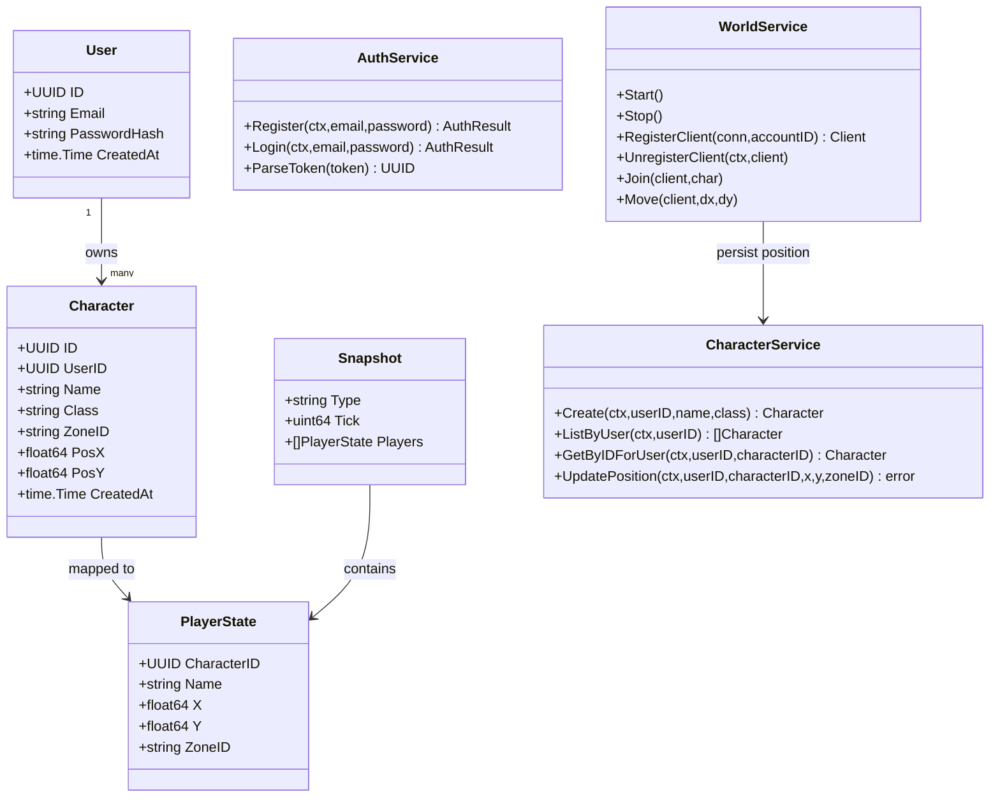
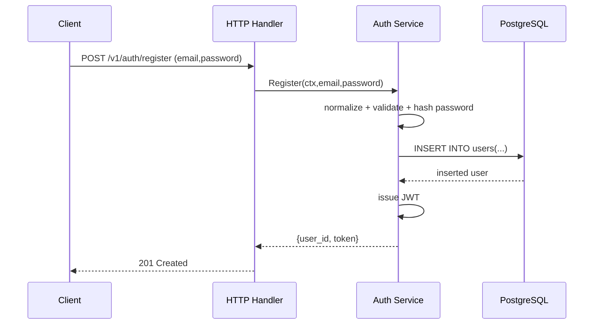
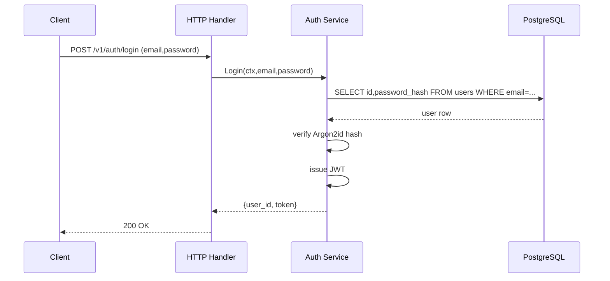
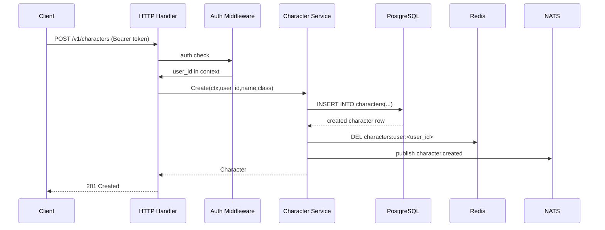
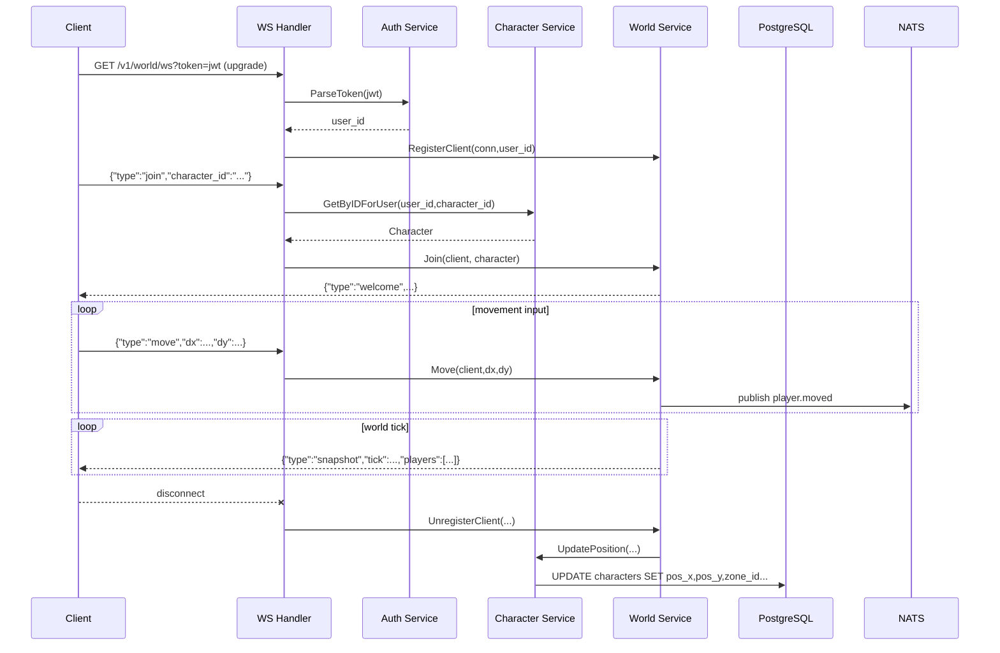
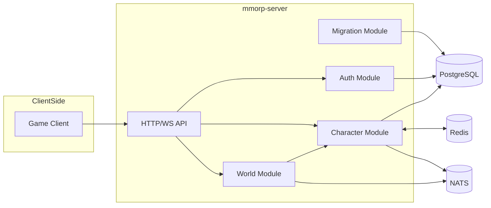
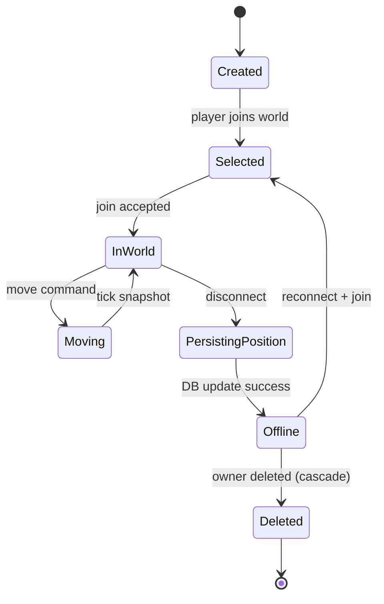
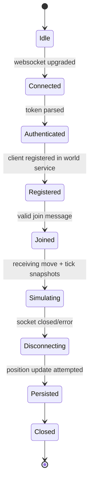

# UML Diagrams (Mermaid)

## Class Diagram (Domain + Key Services)

## Sequence Diagram: Register

## Sequence Diagram: Login

## Sequence Diagram: Create Character

## Sequence Diagram: World Join and Move

## Component Diagram

## State Diagram: Character Lifecycle

## State Diagram: World/Connection Lifecycle

